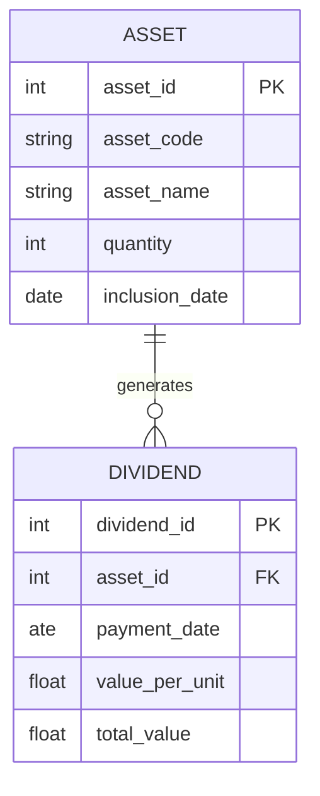

# claro-bootcamp-2024
Projeto Java RESTful API criado para o bootcamp Java da Claro na DIO

```mermaid
erDiagram
    ASSET {
        int asset_id PK
        string asset_code
        string asset_name
        int quantity
        date inclusion_date
    }

    DIVIDEND {
        int dividend_id PK
        int asset_id FK
        ate payment_date
        float value_per_unit
        float total_value
    }    

    ASSET ||--o{ DIVIDEND : "generates"

```
